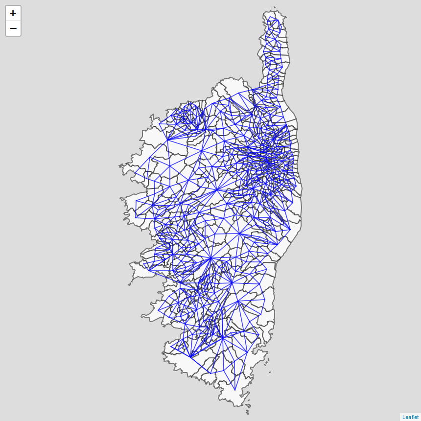
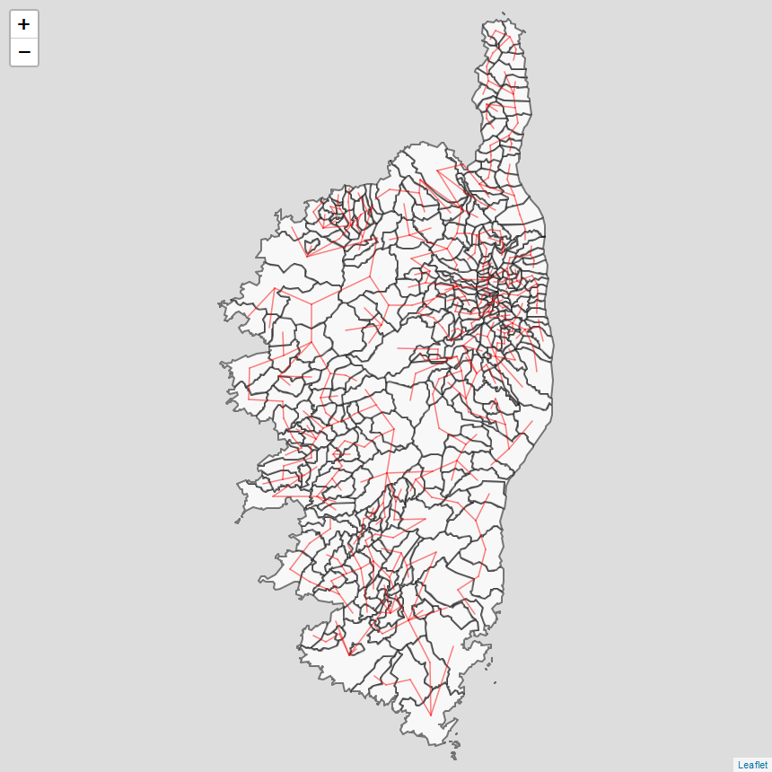
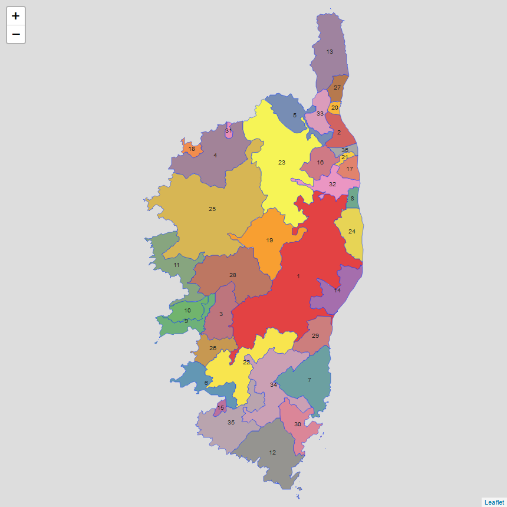
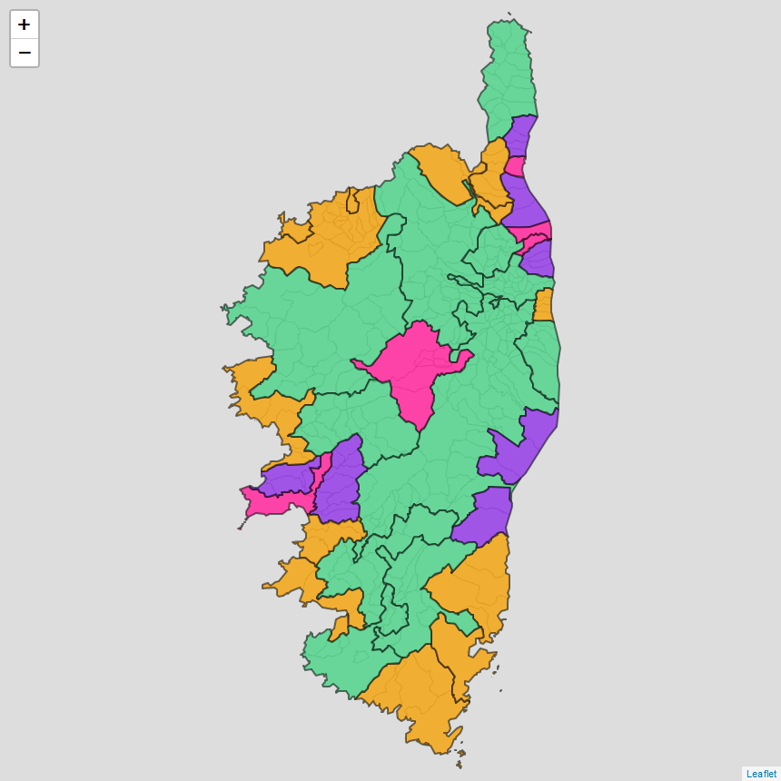
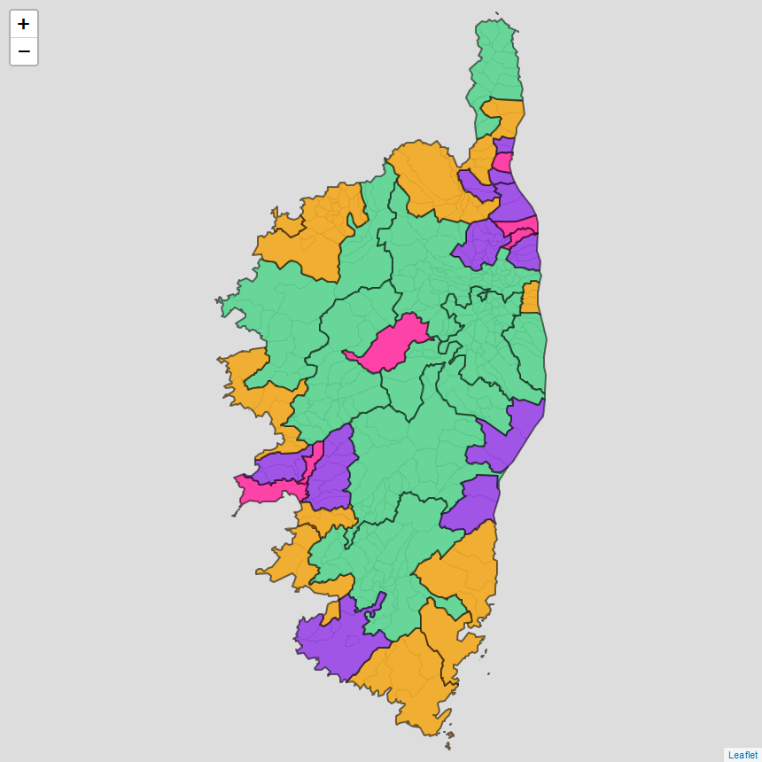
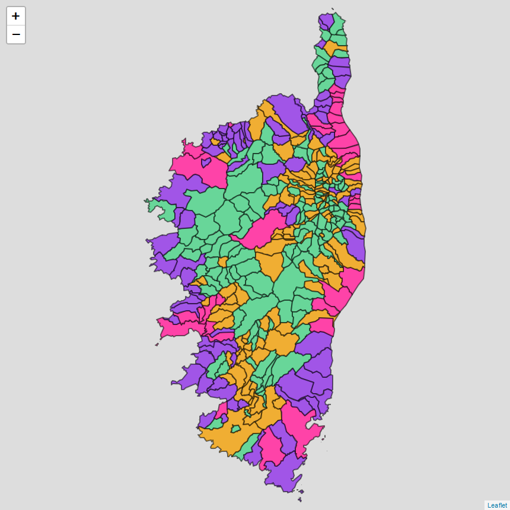
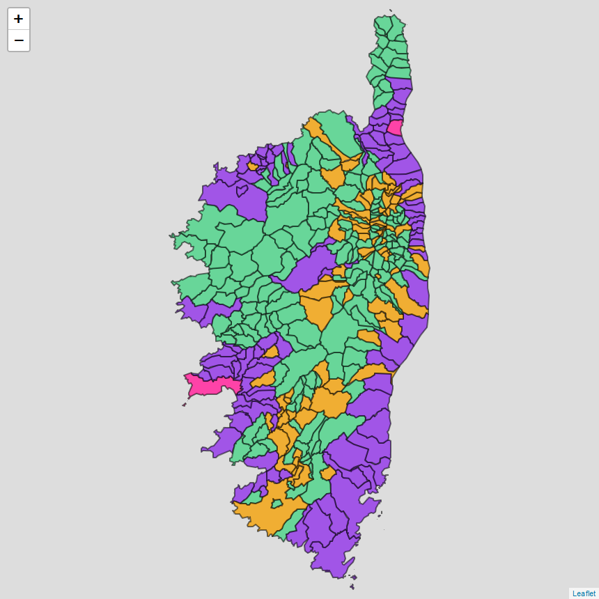
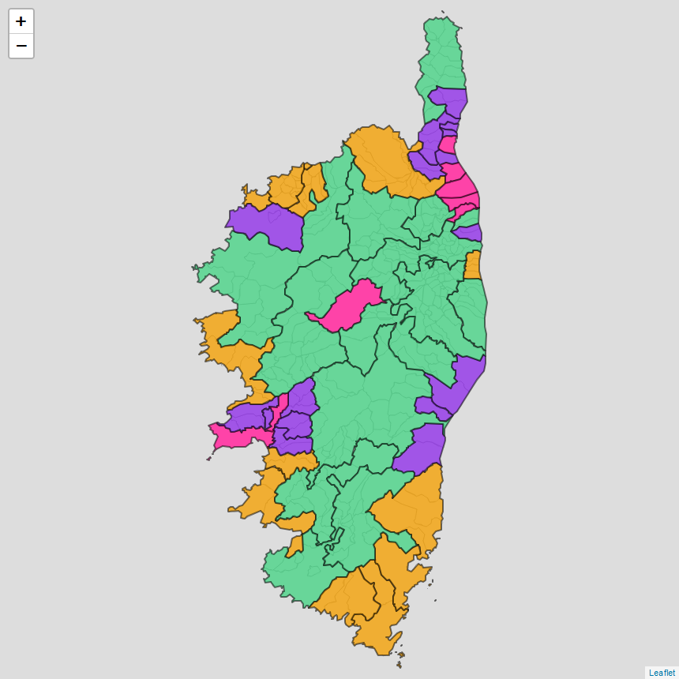

```{r setup, include=FALSE}
knitr::opts_chunk$set(echo = TRUE, message=F,warning=F)
```


<br>

Ce rapport au format HTML a été généré à l'aide de R Markdown.  
L'ensemble des fichiers sources se trouve sur Github à l'adresse suivante : [https://github.com/Chimeglia/Etude_Maille_Habitat/tree/main](https://github.com/Chimeglia/Etude_Maille_Habitat/tree/main)  

On trouve notamment les fichiers suivants : 
  
- *"Rapport_Rmd_Maille_Habitat_AUE.zip"* qui comprend les données sources et le script R Markdown (.Rmd) permettant de générer ce rapport.  
- *"Script_R_seul_AUE.zip"* qui comprend les données sources et un script au format R classique (.R) permettant d'obtenir les résultats de l'étude.   


<br>

# Script étude Maille Habitat

Ce document présente un script basé sur les travaux du CGDD. Nous avons apporté des modifications et réorganisé leur contenu pour améliorer la logique et la compréhensibilité du script.

## Chargement des bibliothèques et suppression des objets en mémoire

```{r biblio}
library(tidyverse)
library(FactoMineR)
library(spdep)
library(sf)
library(readxl)
library(leaflet)
library(htmlwidgets)
library(knitr)
library(rmapshaper)
library (webshot)
```


On charge les bibliothèques nécessaire à l'éxécution du script :

- `tidyverse` : collection de packages conçue pour l'analyse statistique de données. Permet notamment l'utilisation d'une syntaxe plus lisible grâce à l'utilisation des "pipes" (%>%). 
- `sf` : package qui permet l'utilisation de données spatiales (ici le shapefile des communes corses).  
- `spdep` : package d'analyse statistique spatiale (relations de voisinages, arbre couvrant de poids minimum, sectorisation spatiale).
- `FactoMineR` : package R dédié à l'analyse exploratoire multidimensionnelle (Analyse en Composantes Principales (ACP) et Classification Hiérarchique sur Composantes Principales notamment).  
- `readxl` : package qui permet l'importation de données Excel.    
- `leaflet` : package qui permet de réaliser des cartes interactives.  
- `htmlwidgets` : package qui permet d'intégrer des éléments de librairies JavaScript (utilisé ici avec `leaflet` pour rendre les cartes plus lisibles). 
- `knitr` : package qui permet de faciliter la personnalisation des document. Utilisé pour trancer certains tableaux du document. 
- `rmapshaper` : package qui permet de simplifier les données géographiques en réduisant le nombre de points dans les polygones et les lignes.  
- `webshot` : package qui permet de prendre des captures d’écran de pages html.  

<br>


```{r supp}
rm(list = ls())     
```

Code qui permet de supprimer l'ensemble des objets en mémoire dans l'environnement global de la session R.  

<br>


## Importation des données cartographiques

### Import des données

```{r importCarte1, results=FALSE}
Import_carteCommunesCorses=st_read("Données/SHP_COMMUNES/COMMUNE.shp")
```

A l'aide de la fonction `st_read` (package `sf`), on importe les dans l'environnement de travail les données cartographiques comportant les limites communales de l'ensemble des communes corses.   
Il s'agit du fichier shapefile COMMUNE.shp placée dans le répertoire "Données/SHP_COMMUNE".   
Ces données proviennent de la BD TOPO IGN et ont été téléchargées à l'adresse suivante : [https://geoservices.ign.fr/bdtopo](https://geoservices.ign.fr/bdtopo)  

<br>


```{r importCarte2}
carteCommunesCorses=Import_carteCommunesCorses %>% select(INSEE_COM,geometry)
```

Les données importées comportent de nombreuses informations qui ne nous intéressent pas dans la présente étude. On effectue donc une sélection à l'aide de la fonction `select` (package `dplyr` inclus dans la collection `tidyverse`) pour ne conserver que les colonnes qui comportent les codes INSEE des communes (nommée *INSEE_COM*) et les informations spatiales sur leurs limites (nommée *geometry*).  

<br>


```{r importCarte3}
colnames(carteCommunesCorses)[1]="CODGEO"
carteCommunesCorses=carteCommunesCorses %>% arrange(CODGEO)
carteCommunesCorses <- st_transform(carteCommunesCorses, crs = 4326)
```


On renomme (fonction `colnames`) la colonne contenant les codes INSEE en *CODGEO* et on les trie (fonction `arrange` de `dplyr`) par ordre alphabétique pour correspondre à la nomenclature et à l’organisation de notre table de données logement utilisée par la suite.  

Enfin, on utilise la fonction `st_transform` pour transformer les données de `carteCommunesCorses` dans le système de coordonnées  WGS84 ce qui sera nécessaire pour le tracé des carte dans la suite.  
On obtient ainsi la table suivante :
<br>

**carteCommunesCorses** :

```{r importCarte4, echo=F, message=F}
kable(head(carteCommunesCorses))
```

Les objets `MULTIPOLYGON` sont des matrices à 2 colonnes contenant l'ensembles des coordonnées des points composant le contour communal.  
<br>


### Tracé de carteCommunesCorses

```{r, echo=F, message=F,fig.align='center',fig.show='hold' ,fig.width = 10, fig.height = 10}
plot(carteCommunesCorses, main="")
```

<br>

## Chargements des données logements utilisées

### Données logement principales

```{r,chargeBD}
load("Données/Donnees_Logement_2017.RData")
```


On charge le tableau de données nommé `Donnees_Logement_2017` qui comporte les données brutes permettant de construire les indicateurs (sauf données Airbnb).  
Ces données portent sur les 360 communes corses pour l'année 2017. On trouve sur les colonnes les données suivantes :

- **CODGEO** : codes INSEE des communes  
- **LIBGEO** : noms des communes  
- **POP** : population
- **LOG** : nombre de logements (<span style="color:red;">**Source DV3F?**</span>)
- **tot_lgmt** : nombre de logements (<span style="color:red;">**Source FILOCOM ?**</span>)
- **nb_mut** : nombre de transactions dans l’ancien
- **RP** : nombre de résidences principales
- **RSECOCC** : nombre de résidences secondaires
- **LOGVAC** : nombre de logements vacants
- **jeun** : nombre de logements construits après 1975
- **anc** : nombre de logements   construits avant 1949
- **social** : nombre de logements sociaux  
- **proprietaire** : nombre de logements occupés par leur propriétaire  
- **duroc** : durée d’occupation médiane des logements   
- **moyenne_prix** : prix du mètre carré dans l’ancien  
- **rev_ucm** : revenu fiscal médian communal  


<br>


**Donnees_Logement_2017** :

```{r aff_Donnees_Log, echo=F}
DT::datatable(Donnees_Logement_2017)
```


<br>

### Importation des données AirDNA


```{r importAirDNA}
importsAirDNA <- read_excel("Données/stat_airdna_aout2020_mod.xlsx", range = "A4:I364")
airDNA=importsAirDNA %>% select(2,4)
colnames(airDNA)=c("CODGEO","Loc.actives")

Donnees_Logement_2017=Donnees_Logement_2017 %>% inner_join(airDNA, by="CODGEO")
```


A l'aide de la fonction `read_excel` du package `readxl`, on importe dans la table `importsAirDNA` le contenu du fichier Excel “stat_airdna_aout2020.xlsx” qui comporte les données sur le nombre de logements par commune en location sur le site Airbnb en août 2020.  

Ensuite, en construit la table `airDNA` dans laquelle on ne conserve que les colonnes comportant les codes INSEE et les nombres de locations actives par communes. On renomme ces colonnes avec les noms *CODGEO* et *Loc.actives*.
  
Enfin,  on ajoute la colonne *Loc.actives* à la table `Donnees_Logement_2017` en effectuant une jointure par code INSEE à l'aide de la fonction `inner_join` (package `dplyr`).  

<br>
<span style="color:red"><strong>Note : </strong> l'étude du CGDD comporte une erreur dans les données AirDNA : le taux de locations de touristiques apparaît à 0 % au lieu de 17,5 %. Le présent script utilise la même valeur erronée (0 %) afin de retrouver les mêmes résultats que le CGDD. Cette valeur à été modifiée directement dans le fichier Excel source : "Données/stat_airdna_aout2020_mod.xlsx" </span>

<br>

## Calcul des indicateurs par commune


### Génération des indicateurs
```{r indicsCom}
Indicateurs_parCommune= Donnees_Logement_2017 %>% 
  mutate(indic.transac = round(100 * nb_mut / LOG, 1),
         indic.menag = round(POP/RP, 1),
         indic.rs = round(100 * RSECOCC / LOG, 1),
         indic.lv = round(100 * LOGVAC / LOG, 1),
         indic.jeun = round(jeun / anc, 1),
         indic.social = round(100 * social / tot_lgmt, 1),
         indic.prop = round(100 * proprietaire / tot_lgmt, 1),
         indic.duroc = duroc,
         indic.prix = round(100 * moyenne_prix/rev_ucm, 1),
         indic.airbnb=round(100*Loc.actives/LOG, 1)) %>% 
  select(CODGEO,LIBGEO,POP,LOG,contains("indic"))
```


A partir des données de la table `Donnees_Logement_2017`, on construit les indicateurs utilisés dans l'étude : 

- **indic.transac** : nombre de transactions rapporté au nombre de logements (Source : DV3F 2010-2017)  
- **indic.menag** : nombre de personnes par ménage (Source : INSEE, RP)  
- **indic.rs** : taux de résidences secondaires (Source : INSEE, RP)  
- **indic.lv** : taux de logements vacants (Source : INSEE, RP)  
- **indic.jeun** : jeunesse du parc (nombre de logements construits après 1975 rapporté au nombre de logements   construits avant 1949), (Source : FILOCOM)  
- **indic.social** : taux de logements sociaux (Source : FILOCOM)   
- **indic.prop** : le taux de logements occupés par leur propriétaire (Source : FILOCOM)   
- **indic.duroc** : durée d’occupation médiane des logements (Source : FILOCOM)   
- **indic.prix** : prix du mètre carré dans l’ancien rapporté au revenu fiscal médian communal (Source : DV3F, FILOCOM)
- **indic.airbnb** : taux de locations touristiques de courte durée rapporté au parc de logements communal (Source : INSEE-RP, AirDNA)   

Pour construire ces indicateurs, on utilise la fonction `mutate` de la collection `tidyverse` afin d'ajouter ces indicateurs dans de nouvelles colonnes.  
On utilise ensuite la fonction `select` (`tidyverse` également) afin de ne conserver que les données qui nous intéressent (indicateurs) et d'enlever les données brutes de la table `Donnees_Logement_2017`.

<br>

### Nettoyage des données

```{r indicsCom2}
Indicateurs_parCommune=Indicateurs_parCommune %>% mutate_if(is.numeric, funs(ifelse(is.na(.), 0, .)))
```


A l'aide des fonction `mutate_if` et `ifelse`, on remplace les valeurs NA par 0 dans la table `Indicateurs_parCommune`  

<br>

```{r indicsCom3}
winsorisation= function (x, prob.min = 0.01, prob.max = .99){
  a <- quantile(x, probs = c(prob.min, prob.max))
  x[x > a[2]] <- a[2]
  x[x < a[1]] <- a[1]
  return(x)
}
```

On crée la fonction `winsorisation` qui vise à limiter l'impact de données aberrantes  : les valeurs en deçà du 1^er^ centile sont remplacées par la valeur de ce centile. Idem pour les valeurs au delà du dernier centile. 

<br>

<span style="color:red"><strong>Commentaire personnel : </strong> Dans notre cas (échantillon de petite taille), l'utilisation de la fonction winsorisation génère une importante perte d'information, est-elle pertinente ?   
Par exemple, Bastia possède un taux de logements sociaux beaucoup plus élevé que les autres communes corses (21,4 % contre seulement 12,1 % pour Vescovato qui arrive 2^ème^ position). Cette information est donc perdue en appliquant la winsorization, la nouvelle valeur attribuée pour Bastia étant de 10,0 % </span>


<br>

```{r indicsCom4}
listeIndicateurs=Indicateurs_parCommune %>% select(contains("indic")) %>% names()
Indicateurs_parCommune[listeIndicateurs]=apply(Indicateurs_parCommune[listeIndicateurs],MARGIN = 2, FUN = winsorisation)
Indicateurs_parCommune_valeurs=Indicateurs_parCommune[listeIndicateurs]
```

On crée la table `listeIndicateurs` qui comporte les noms des indicateurs.  

A l'aide de la fonction `apply`, on applique la fonction `winsorisation` précedemment créée à l'ensemble des colonnes d'indicateurs (spécifié par l'argument MARGIN=2, (MARGIN=1 correspondrait au lignes)) de la table `Indicateurs_parCommune`.  

On construit également la table `Indicateurs_parCommune_valeurs` qui ne comporte strictement que les les données des indicateurs (les colonnes *CODGEO*,*LIBGEO*, *POP*, *LOG* ont été enlevées).  

<br>


## Définition des mailles

### Calcul de la matrice de voisinage

```{r Voisinage1}
carteCommunesCorses_spdf=carteCommunesCorses %>% left_join(Indicateurs_parCommune,by="CODGEO")%>% select(CODGEO,LIBGEO,POP) %>%  as("Spatial")
```
On effectue une jointure par code INSEE entre les tables `carteCommunesCorses` et `Indicateurs_parCommune` pour récupérer à la fois les données cartographiques et la population par commune.  

On ne conserve seulement que les codes INSEE, la population et les données cartographiques (coordonnées des polygones) en utilisant la fonction `select`.  
A noter : lorsqu'on applique la fonction `select` à un fichier comportant des données spatiales, la colonne comportant ces données (*geometry*) est sélectionnée d'office.  

On convertit les données au format spdf (nécessaire pour la suite) à l'aide de la fonction `as('Spatial')`.

<br>

```{r Voisinage2}
table_voisinage=poly2nb(carteCommunesCorses_spdf,queen=F)
```

On construit la "matrice" de voisinage `table_voisinage` (il s'agit en fait d'une liste de vecteurs). Chaque vecteur correspond à une commune. Il comporte la liste de ses communes voisines (indice des communes voisines).  

Par exemple, la 1^ère^ commune (dans l'ordre des communes de notre jeu de données) de la liste est voisine avec les 2^ème^, 3^ème^, 7^ème^ et 94^ème^ communes.  

<br>

**table_voisinage** :

```{r, apercuMatriceVoisinage, echo=F, message=F}

head(table_voisinage)
```


L'argument "*queen = F*" permet de ne pas considérer comme voisines les communes qui ont un seul point de frontière en commun (63 communes dans ce cas).  
<br>
On trace ci-dessous la matrice de voisinage : les centroïdes de chaque communes voisines sont reliés par une arête.


### Tracé de la matrice de voisinage


```{r, echo=F,fig.align='center',fig.show='hold' ,fig.width = 9, fig.height = 9, include=FALSE}


# Nouvelle colonne contenant le texte à afficher dans les fenêtres contextuelles
Donnees_Logement_2017$popup_text = ""
for (i in 3:(ncol(Donnees_Logement_2017)-1)) {
  Donnees_Logement_2017$popup_text <- paste0(Donnees_Logement_2017$popup_text,
                                             names(Donnees_Logement_2017)[i], " : ", Donnees_Logement_2017[[i]], "<br>")
}


# Fusionner les données
carteCommunesCorses_merged = left_join(carteCommunesCorses, Donnees_Logement_2017, by = "CODGEO")

# Convertir les données en format compatible avec leaflet
carteCommunesCorses_sf = st_as_sf(carteCommunesCorses_merged)

# Calculer les centroïdes des polygones
centroids = st_centroid(carteCommunesCorses_sf)

# Extraire les coordonnées des centroïdes
coords = st_coordinates(centroids)

# Créer la carte interactive
carte1 = leaflet(carteCommunesCorses_sf) %>%
#  addTiles() %>%
  addPolygons(fillColor = "white",
              fillOpacity = 0.8,
              color = "black",
              weight = 2,
              popup = ~paste0("<b>", LIBGEO, "</b><br>", popup_text))


# Ajouter les arêtes entre les polygones voisins
for (i in seq_along(table_voisinage)) {
  for (j in table_voisinage[[i]]) {
    carte1 = addPolylines(carte1,
                          lng = c(coords[i,1], coords[j,1]),
                          lat = c(coords[i,2], coords[j,2]),
                          color = "blue",weight = 1.5)
  }
}

# Ajouter les étiquettes aux polygones
carte1 =  addLabelOnlyMarkers(carte1,
                             data = centroids,
                             lng = ~coords[,1],
                             lat = ~coords[,2],
                             label = ~Donnees_Logement_2017$LIBGEO,
                             labelOptions = labelOptions(noHide = T))
                             

# Exécuter du code JavaScript personnalisé pour afficher les étiquettes en fonction du niveau de zoom
carte1 = onRender(carte1, "
  function(el, x) {
    // Récupérer l'objet de la carte
    var map = this;

    // Définir une fonction pour mettre à jour l'affichage des étiquettes
    function updateLabels() {
      // Récupérer le niveau de zoom actuel
      var zoom = map.getZoom();

      // Parcourir tous les marqueurs de la carte
      map.eachLayer(function(layer) {
        if (layer instanceof L.Marker) {
          // Vérifier si le marqueur a une étiquette
          if (layer.getTooltip()) {
            // Afficher ou masquer l'étiquette en fonction du niveau de zoom
            if (zoom >= 10.3) {
              layer.getTooltip().setOpacity(1);
            } else {
              layer.getTooltip().setOpacity(0);
            }
          }
        }
      });
    }

    // Mettre à jour l'affichage des étiquettes lorsque le niveau de zoom change
    map.on('zoomend', updateLabels);

    // Mettre à jour l'affichage des étiquettes lors du premier affichage de la carte
    updateLabels();
  }
")


widget_file1 <- "Cartes_Interactives/carte_interactive_1.html"
saveWidget(carte1, file = widget_file1)
webshot("Cartes_Interactives/carte_interactive_1.html", file = "Cartes_Interactives/carte1.png",vwidth = 860, vheight = 860)
```


<br>
*Cliquer sur l'image pour afficher la carte interactive*
<a href="Cartes_Interactives/carte_interactive_1.html" target="_blank"></a>

<br>


### Pondération des arêtes

```{r pondération1}
ACP_parCommunes <- Indicateurs_parCommune_valeurs %>%  PCA(graph = F)
```

On réalise une Analyse en Composantes Principales sur nos indicateurs (`Indicateurs_parCommune_valeurs`) en utilisant la fonction `PCA` du Package `FactoMineR`.

<br>

```{r pondération2}
nb_dim <- which(ACP_parCommunes$eig[, 3] > 80)[1] 
nb_dim
```

A partir du résutat , on détermine le nombre de composantes qui permet de conserver 80% de la variance des données (ce nombre est arbitraire mais c'est une valeur courrament utilisée en analyse statistique).\

Ce nombre est ici égal à 6 alors que par défaut l'ACP ne conserve que 5 dimensions dans les résultats.\

On relance donc l'ACP en fixant à 6 le nombre de dimensions à conserver :

```{r pondération3}
ACP_parCommunes <- Indicateurs_parCommune_valeurs %>%  PCA(graph = F,ncp = nb_dim)
```

<br>

```{r pondération4}
donnees_pondérations=ACP_parCommunes$ind$coord
```

On récupère dans la table `donnees_pondérations`, les coordonnées des individus selon les nouvelles composantes.  

<br>

```{r pondération5}
pondérations=nbcosts(table_voisinage, data = donnees_pondérations)
```

On pondère chaque arête du graphe de voisinage à partir des nouvelles coordonnées résultantes de l'ACP.\

Le poids affecté à l'arête entre les les individus (communes) i et j par nbcost est donné par la formule suivante :\
$$Poids_{ij}=\sqrt{\sum_{k}(dat[j,k]-dat[i,k])^2}$$
Autrement dit :\
"Le poids affectée à une arête entre 2 communes correspond à la racine de [la somme sur l'ensemble des dimensions des [[écarts entre les 2 communes sur chaque indicateur] au carré]]".

Ainsi plus les données entre 2 communes sont semblables, plus le poids affecté à l'arête est faible.  

<br>

**pondérations** :


```{r pondération6, echo=F}
head(pondérations)
```

La liste `pondérations` à la même structure que la "matrice" de voisinage `table_voisinage` mais elle comporte les poids des arêtes à la places des indices des communes.

<br>

```{r pondération57}
table_voisinage_pondérée=nb2listw(table_voisinage, glist = pondérations, style = "C")
```

La fonction `nb2listw` regroupe les "matrices" de voisinage `table_voisinage` et de pondération `pondérations` dans un même objet `table_voisinage_pondérée`.  

L'argument `style = "C"` normalise les poids de sorte que le poids du graphe (somme des poids de toutes les arêtes) soit égal au nombre de sommets (communes).

<br>


### Arbre couvrant de poids minimal


```{r arbre_poids_minimal1}
arbre_poids_minimal <- mstree(table_voisinage_pondérée)
```
La fonction `mstree` (Minimum Spanning Tree) permet d'obtenir l'arbre couvrant de poids minimal à partir des données de pondération et de voisinage obtenues précédemment.  
Il s'agit d'un sous-graphe du graphe de voisinage, qui passe par l'ensemble des communes, qui ne comporte pas de cycle et dont la somme des poids des arêtes est minimale.  
Cet arbre possède donc 359 arêtes.  
<br>
Ci-dessous, un aperçu de la table nommée `arbre_poids_minimal` obtenue :  
<br>
**arbre_poids_minimal** :

```{r arbre_poids_minimal2, echo=F}
DT::datatable(arbre_poids_minimal)
```

Les 2 premières colonnes donnent les coordonnées des arêtes de l'arbre et la 3<sup>ème</sup> colonne correspond aux pondérations affectées à ces arêtes.  
Ainsi, sur la 1<sup>ère</sup> ligne on lit que la 15<sup>ème</sup> commune est relié à la 61<sup>ème</sup> par une arête dont le poids est 0.0996...  
<br>

### Tracé de l'arbre couvrant de poids minimal


```{r trace_arbre_poids_minimal, echo=F,fig.align='center',fig.show='hold' ,fig.width = 9, fig.height = 9, include=FALSE}


# Créer la carte interactive
carte2 = leaflet(carteCommunesCorses_sf) %>%
#  addTiles() %>%
  addPolygons(fillColor = "white",
              fillOpacity = 0.8,
              color = "black",
              weight = 2,
              popup = ~paste0("<b>", LIBGEO, "</b><br>", popup_text))


# On ajoute les arêtes de l'arbre couvrant
for (i in seq_len(nrow(arbre_poids_minimal))) {
    carte2 <- addPolylines(carte2, lng = c(coords[arbre_poids_minimal[i,1],1], coords[arbre_poids_minimal[i,2],1]), lat = c(coords[arbre_poids_minimal[i,1],2], coords[arbre_poids_minimal[i,2],2]), color = "red", weight = 1.5)
}


# Ajouter les étiquettes aux polygones
carte2 = addLabelOnlyMarkers(carte2,
                             data = centroids,
                             lng = ~coords[,1],
                             lat = ~coords[,2],
                             label = ~Donnees_Logement_2017$LIBGEO,
                             labelOptions = labelOptions(noHide = T))
                             

# Exécuter du code JavaScript personnalisé pour afficher les étiquettes en fonction du niveau de zoom
carte2 =  onRender(carte2, "
  function(el, x) {
    // Récupérer l'objet de la carte
    var map = this;

    // Définir une fonction pour mettre à jour l'affichage des étiquettes
    function updateLabels() {
      // Récupérer le niveau de zoom actuel
      var zoom = map.getZoom();

      // Parcourir tous les marqueurs de la carte
      map.eachLayer(function(layer) {
        if (layer instanceof L.Marker) {
          // Vérifier si le marqueur a une étiquette
          if (layer.getTooltip()) {
            // Afficher ou masquer l'étiquette en fonction du niveau de zoom
            if (zoom >= 10.3) {
              layer.getTooltip().setOpacity(1);
            } else {
              layer.getTooltip().setOpacity(0);
            }
          }
        }
      });
    }

    // Mettre à jour l'affichage des étiquettes lorsque le niveau de zoom change
    map.on('zoomend', updateLabels);

    // Mettre à jour l'affichage des étiquettes lors du premier affichage de la carte
    updateLabels();
  }
")

widget_file2 <- "Cartes_Interactives/carte_interactive_2.html"
saveWidget(carte2, file = widget_file2)
webshot("Cartes_Interactives/carte_interactive_2.html", file = "Cartes_Interactives/carte2.png",vwidth = 860, vheight = 860)

```


<br>
*Cliquer sur l'image pour afficher la carte interactive*
<a href="Cartes_Interactives/carte_interactive_2.html" target="_blank"></a>

<br>

### Génération des mailles (SKATER)

#### Algorithme SKATER

```{r maillage1}
nb_mailles=36
population_min=2500

resultat_skater=skater(edges = arbre_poids_minimal[,1:2],data=donnees_pondérations,ncuts=nb_mailles-1,crit=population_min,vec.crit=Donnees_Logement_2017$POP)
```

On réalise le maillage du territoire grâce à l'algorithme de partitionnement spatial `skater` du package `spdep`.
On commence par définir le nombre de mailles choisi (36 dans la présente étude) et la contrainte de population minimale de chaque maille (2500 ici)
Celui-ci supprime les liens de plus forts poids dans l'arbre couvrant de poids minimum précédemment calculé (`arbre_poids_minimal`), tout en respectant la contrainte de population imposée sur e nombre et la taille des mailles.  

On définit en argument de la fonction `skater` :

- *edges* : les coordonnées des arêtes (numéro des communes reliés ensembles). Il s'agit des 2 premières colonnes de la table `arbre_poids_minimal`.  
- *data* : les poids des arêtes (table `donnees_pondérations`).   
- *ncuts* : le nombre d'arêtes à supprimer par l'algorithme : 35 ici pour obtenir 36 mailles.   
- *crit* : valeur minimale du vecteur défini dans l'argument suivant (vec.crit) à respecter pour chaque maille (2500 dans notre cas).   
- *vec.crit* : vecteur sur lequel s'applique la contrainte (colonne *POP* de la table `Donnees_Logement_2017` dans notre cas (population)).   
<br>
  
En sortie, fonction `skater` permet d'obtenir le numéro de maille pour chacune des communes.Cette information se trouve dans la table `resultat_skater$group`
<br>

**resultat_skater$group :**

```{r maillage2, echo=F}
head(resultat_skater$group,20)
```
Ainsi on constate que la 1^ère^ commune de notre jeu de données (Afà) est dans la maille n°11, la 2^ème^ (Ajaccio) est dans la maille n°9, etc...

<br>

#### Construction de la carte des mailles

```{r carteMaille1}
carteMailles=carteCommunesCorses %>% mutate(maille=resultat_skater$groups) %>%  group_by(maille) %>%  summarise(geometry = st_union(geometry))
```

On crée la table `carteMailles` comportant les données spatiales des mailles :

- On ajoute les numéro de mailles de chaque communes à la table `carteCommunesCorses` avec la fonction `mutate`.  
- On regroupe les données par maille avec la fonction `group_by`.  
- On crée les nouvelles données spatiales des mailles (colonne *geometry*) par réunion des données communales à l'aides des fonction `summarise` et `st_union`

<br>

#### Carte de la carte des mailles


```{r trace_carteMaille1, echo=F,fig.align='center',fig.show='hold' ,fig.width = 9, fig.height = 9, include=FALSE}


# Création d'une palette de couleurs
pal=colorFactor(palette = "Set1", domain = carteMailles$maille)


carteMailles$geometry = st_cast(carteMailles$geometry, "MULTIPOLYGON")
# Calcul des centroïdes des polygones
centroids <- st_centroid(carteMailles)

carte3 = carteMailles %>%
  leaflet() %>%
  addPolygons(fillColor = ~pal(maille), fillOpacity = 0.8, weight = 1) %>%
  addLabelOnlyMarkers(
    data = centroids,
    label = ~as.character(maille),
    labelOptions = labelOptions(noHide = T, direction = 'center', textOnly = TRUE)
  )

widget_file3 <- "Cartes_Interactives/carte_interactive_3.html"
saveWidget(carte3, file = widget_file3)
webshot("Cartes_Interactives/carte_interactive_3.html", file = "Cartes_Interactives/carte3.png",vwidth = 860, vheight = 860)
```


<br>
*Cliquer sur l'image pour afficher la carte interactive*
<a href="Cartes_Interactives/carte_interactive_3.html" target="_blank"></a>

<br>


<br>


## Calcul des indicateurs par maille

```{r indicsMailles}
Maillage=data.frame(CODGEO=Indicateurs_parCommune$CODGEO,maille=resultat_skater$groups)

Indicateurs_parMaille=Maillage %>% 
  left_join(Donnees_Logement_2017, by="CODGEO") %>% 
  group_by(maille) %>% 
  summarise_if(is.numeric, funs(sum(., na.rm = TRUE))) %>% 
  mutate(indic.transac = round(100 * nb_mut / LOG, 1),
         indic.menag = round(POP/RP, 1),
         indic.rs = round(100 * RSECOCC / LOG, 1),
         indic.lv = round(100 * LOGVAC / LOG, 1),
         indic.jeun = round(jeun / anc, 1),
         indic.social = round(100 * social / tot_lgmt, 1),
         indic.prop = round(100 * proprietaire / tot_lgmt, 1),
         indic.duroc = duroc,
         indic.prix = round(100 * moyenne_prix/rev_ucm, 1),
         indic.airbnb=round(100*Loc.actives/LOG, 1)) %>% 
  select(maille,POP,LOG,contains("indic")) %>% 
  mutate_if(is.numeric, funs(ifelse(is.na(.), 0, .)))


Indicateurs_parMaille_valeurs=Indicateurs_parMaille %>% select(contains("indic"))
Indicateurs_parMaille_valeurs=Indicateurs_parMaille_valeurs %>% apply(MARGIN = 2, FUN = winsorisation)
```

On calcule de nouveau les indicateurs mais sur les mailles cette fois-ci et non plus sur les communes comme précédemment.  

Pour cela on regroupe les données par maille à l'aide de la fonction `group_by` et on somme les données des communes de chacune des mailles à l'aide de la fonction `summarise_if`. 

On nettoie également les données (winsoriration et suppression des NA) et on créée une table `Indicateurs_parMaille_valeurs` qui ne comporte que les valeurs des indicateurs


## Sectorisation

### Classification Hiérarchique sur Composantes Principales
```{r sectorisation}

acp_parMailles=PCA(Indicateurs_parMaille_valeurs,ncp=5,graph=F)
hc4 <- HCPC(acp_parMailles, nb.clust = 4, consol = T, graph = F)
cl4 <- data.frame(maille = Indicateurs_parMaille$maille, cl_maille4 = hc4$data.clust[,"clust"])
```

On effectue une une ACP sur les données regoupées par maille.  

On effectue une classification hiérarchique sur les résultats de l’ACP (données par maille).  

On stocke les résultats dans la table `cl4` : numéro de maille dans la 1^ère^ colonne et numéro du secteur dans la 2^nde^ colonne.  


### Tracé des secteurs


```{r traceSecteurs, echo=F,fig.align='center',fig.show='hold' ,fig.width = 9, fig.height = 9, include=FALSE}
# Fusion des tables carteMailles et cl_maille4
carteMaillesSecteurs = left_join(carteMailles, cl4, by = "maille")

# Simplifier les données géographiques
carteMaillesSecteurs_simplified <- ms_simplify(carteMaillesSecteurs)

# Création d'une palette de couleurs pour les secteurs
palSecteurs = colorFactor(palette = c("seagreen3", "orange2", "blueviolet", "deeppink"), domain = carteMaillesSecteurs_simplified$cl_maille4)

# Création d'une carte des communes avec un trait gris fin
carteCommunes = leaflet(carteCommunesCorses_sf) %>%
  addPolygons(fillColor = "white",
              fillOpacity = 0.8,
              color = "gray",
              weight = 1,
              popup = ~paste0("<b>", LIBGEO, "</b><br>", popup_text))

# Ajout des mailles avec un trait noir plus épais et colorées selon le secteur
carte4 = carteCommunes %>%
  addPolygons(data = carteMaillesSecteurs_simplified,
              fillColor = ~palSecteurs(cl_maille4),
              fillOpacity = 0.8,
              color = "black",
              weight = 2)

widget_file4 <- "Cartes_Interactives/carte_interactive_4.html"
saveWidget(carte4, file = widget_file4)
webshot("Cartes_Interactives/carte_interactive_4.html", file = "Cartes_Interactives/carte4.png",vwidth = 860, vheight = 860)
```

<br>
*Cliquer sur l'image pour afficher la carte interactive*
<a href="Cartes_Interactives/carte_interactive_4.html" target="_blank"></a>


<br>
<br>
<br>


<br>
<br>

# Script génération de mailles d'autres tailles

## Génération des mailles et secteurs

Script permettant de générer un maillage défini par l'utilisateur.  
Le nombre de mailles et la population minimale des mailles doivent être définis au début du script (`nb_mailles` et `population_min`).  
La variable booléenne `Sauvegarde` permet choisir si on souhaite que le fichier résultat soit enregistré (dans le répertoire Maillage).  
Le script peut être copié dans une page de script R classique ou bien lancé directement dans le chunk R Markdown.

<br>

```{r GenerationMailleDif,echo=T, eval=F}
rm(list=ls())

nb_mailles=300
population_min=500
Sauvegarde=TRUE


library(tidyverse)
library(FactoMineR)
library(spdep)
library(sf)
library(readxl)
library(leaflet)
library(htmlwidgets)
load("Données/Donnees_Logement_2017.RData")
importsAirDNA <- read_excel("Données/stat_airdna_aout2020_mod.xlsx", range = "A4:I364")
Import_carteCommunesCorses=st_read("Données/SHP_COMMUNES/COMMUNE.shp")
carteCommunesCorses=Import_carteCommunesCorses %>% select(INSEE_COM,geometry)
colnames(carteCommunesCorses)[1]="CODGEO"
carteCommunesCorses=carteCommunesCorses %>% arrange(CODGEO)
carteCommunesCorses <- st_transform(carteCommunesCorses, crs = 4326)
airDNA=importsAirDNA %>% select(2,4)
colnames(airDNA)=c("CODGEO","Loc.actives")
Donnees_Logement_2017=Donnees_Logement_2017 %>% inner_join(airDNA, by="CODGEO")
Indicateurs_parCommune= Donnees_Logement_2017 %>% 
  mutate(indic.transac = round(100 * nb_mut / LOG, 1),
         indic.menag = round(POP/RP, 1),
         indic.rs = round(100 * RSECOCC / LOG, 1),
         indic.lv = round(100 * LOGVAC / LOG, 1),
         indic.jeun = round(jeun / anc, 1),
         indic.social = round(100 * social / tot_lgmt, 1),
         indic.prop = round(100 * proprietaire / tot_lgmt, 1),
         indic.duroc = duroc,
         indic.prix = round(100 * moyenne_prix/rev_ucm, 1),
         indic.airbnb=round(100*Loc.actives/LOG, 1)) %>% 
  select(CODGEO,LIBGEO,POP,LOG,contains("indic"))
Indicateurs_parCommune=Indicateurs_parCommune %>% mutate_if(is.numeric, funs(ifelse(is.na(.), 0, .)))
winsorisation= function (x, prob.min = 0.01, prob.max = .99){
  a <- quantile(x, probs = c(prob.min, prob.max))
  x[x > a[2]] <- a[2]
  x[x < a[1]] <- a[1]
  return(x)
}
listeIndicateurs=Indicateurs_parCommune %>% select(contains("indic")) %>% names()
Indicateurs_parCommune[listeIndicateurs]=apply(Indicateurs_parCommune[listeIndicateurs],MARGIN = 2, FUN = winsorisation)
Indicateurs_parCommune_valeurs=Indicateurs_parCommune[listeIndicateurs] 
carteCommunesCorses_spdf=carteCommunesCorses %>% left_join(Indicateurs_parCommune,by="CODGEO")%>% select(CODGEO,LIBGEO,POP) %>%  as("Spatial")
table_voisinage=poly2nb(carteCommunesCorses_spdf,queen=F)
ACP_parCommunes <- Indicateurs_parCommune_valeurs %>%  PCA(graph = F)
nb_dim <- which(ACP_parCommunes$eig[, 3] > 80)[1] 
ACP_parCommunes <- Indicateurs_parCommune_valeurs %>%  PCA(graph = F,ncp = nb_dim)
donnees_pondérations=ACP_parCommunes$ind$coord
pondérations=nbcosts(table_voisinage, data = donnees_pondérations)
table_voisinage_pondérée=nb2listw(table_voisinage, glist = pondérations, style = "C")
arbre_poids_minimal <- mstree(table_voisinage_pondérée)

resultat_skater=skater(edges = arbre_poids_minimal[,1:2],data=donnees_pondérations,ncuts=nb_mailles-1,crit=population_min,vec.crit=Donnees_Logement_2017$POP)

carteMailles=carteCommunesCorses %>% mutate(maille=resultat_skater$groups) %>%  group_by(maille) %>%  summarise(geometry = st_union(geometry))

Maillage=data.frame(CODGEO=Indicateurs_parCommune$CODGEO,maille=resultat_skater$groups)

Indicateurs_parMaille=Maillage %>% 
  left_join(Donnees_Logement_2017, by="CODGEO") %>% 
  group_by(maille) %>% 
  summarise_if(is.numeric, funs(sum(., na.rm = TRUE))) %>% 
  mutate(indic.transac = round(100 * nb_mut / LOG, 1),
         indic.menag = round(POP/RP, 1),
         indic.rs = round(100 * RSECOCC / LOG, 1),
         indic.lv = round(100 * LOGVAC / LOG, 1),
         indic.jeun = round(jeun / anc, 1),
         indic.social = round(100 * social / tot_lgmt, 1),
         indic.prop = round(100 * proprietaire / tot_lgmt, 1),
         indic.duroc = duroc,
         indic.prix = round(100 * moyenne_prix/rev_ucm, 1),
         indic.airbnb=round(100*Loc.actives/LOG, 1)) %>% 
  select(maille,POP,LOG,contains("indic")) %>% 
  mutate_if(is.numeric, funs(ifelse(is.na(.), 0, .)))


Indicateurs_parMaille_valeurs=Indicateurs_parMaille %>% select(contains("indic"))
Indicateurs_parMaille_valeurs=Indicateurs_parMaille_valeurs %>% apply(MARGIN = 2, FUN = winsorisation)
acp_parMailles=PCA(Indicateurs_parMaille_valeurs,ncp=5,graph=F)
hc4 <- HCPC(acp_parMailles, nb.clust = 4, consol = T, graph = F)
cl4 <- data.frame(maille = Indicateurs_parMaille$maille, cl_maille4 = hc4$data.clust[,"clust"])
carteMaillesSecteurs <- left_join(carteMailles, cl4, by = "maille")

carteCommunesCorses_merged <- left_join(carteCommunesCorses, Donnees_Logement_2017, by = "CODGEO")
carteCommunesCorses_sf <- st_as_sf(carteCommunesCorses_merged)

nom_sauvegarde <- paste0("Résultat_", nb_mailles, "_mailles_", population_min, "_min")

if (Sauvegarde) {  save(carteMaillesSecteurs,carteCommunesCorses_sf, file = paste0("Maillages/",nom_sauvegarde, ".RData"))}


```
<br>

## Tracé des mailles et secteurs

Script permettant de tracer les mailles et les communes d'un fichier préalablement enregistré.
Le nombre de mailles et la population minimale des mailles doivent être définis au début du script (`nb_mailles` et `population_min`).  

<br>

```{r traceSecteurs_diff, echo=T, eval=F ,fig.align='center',fig.show='hold' ,fig.width = 9, fig.height = 9}
#nb_mailles=36
#population_min=2500

print(paste0("Résultat_", nb_mailles, "_mailles_", population_min, "_min"))

nom_a_charger=paste0("Maillages/Résultat_", nb_mailles, "_mailles_", population_min, "_min.RData")
load(nom_a_charger)

# Création d'une palette de couleurs pour les secteurs
palSecteurs = colorFactor(palette = c("seagreen3", "orange2","blueviolet", "deeppink"), domain = carteMaillesSecteurs$cl_maille4)


# Création d'une carte des communes avec un trait gris fin
carteCommunes = leaflet(carteCommunesCorses_sf) %>%
  addPolygons(fillColor = "white",
              fillOpacity = 0.8,
              color = "gray",
              weight = 1)

# Ajout des mailles avec un trait noir plus épais et colorées selon le secteur
carte5=carteCommunes %>%
  addPolygons(data = carteMaillesSecteurs,
              fillColor = ~palSecteurs(cl_maille4),
              fillOpacity = 0.8,
              color = "black",
              weight = 2)

widget_file5 <- "Cartes_Interactives/carte_interactive_5.html"
saveWidget(carte5, file = widget_file5)
webshot("Cartes_Interactives/carte_interactive_5.html", file = "Cartes_Interactives/carte5.png",vwidth = 860, vheight = 860)
```

<br>
*Cliquer sur l'image pour afficher la carte interactive*
<a href="Cartes_Interactives/carte_interactive_5.html" target="_blank"></a>

<br>
<br>

# Réalisation de différents essais et modifications (jeu de données, méthodologie)

Essais et modifications potentiels : 

- Correction de l'erreur de valeur sur le données AirDNA
- Suppression de la winsorisation
- Modification du nombre de composantes de l'ACP pour réaliser le maillage. On peut également supprimer l'étape d'ACP pour le maillage mais il faut a minima standardiser les données (données centrées-réduites).
- Modification du nombre de composantes de l'ACP pour réaliser la sectorisation.
- Réalisation d'un sectorisation sans maillage préalable
- Modification du nombre et de la taille des mailles
- Ajout/suppression d'indicateurs
- ... ?


## Modifications du script n°1

  
Synthèse des modifications : 

- Suppression de la winsorisation
- Correction de l'erreur dans les données AirDNA


```{r codeMofifie,echo=F, eval=T, include = F}
rm(list=ls())

nb_mailles=36
population_min=2500
Sauvegarde=TRUE


library(tidyverse)
library(FactoMineR)
library(spdep)
library(sf)
library(readxl)
library(leaflet)
library(htmlwidgets)
load("Données/Donnees_Logement_2017.RData")
importsAirDNA <- read_excel("Données/stat_airdna_aout2020_corr.xlsx", range = "A4:I364")
Import_carteCommunesCorses=st_read("Données/SHP_COMMUNES/COMMUNE.shp")
carteCommunesCorses=Import_carteCommunesCorses %>% select(INSEE_COM,geometry)
colnames(carteCommunesCorses)[1]="CODGEO"
carteCommunesCorses=carteCommunesCorses %>% arrange(CODGEO)
carteCommunesCorses <- st_transform(carteCommunesCorses, crs = 4326)
airDNA=importsAirDNA %>% select(2,4)
colnames(airDNA)=c("CODGEO","Loc.actives")
Donnees_Logement_2017=Donnees_Logement_2017 %>% inner_join(airDNA, by="CODGEO")
Indicateurs_parCommune= Donnees_Logement_2017 %>% 
  mutate(indic.transac = round(100 * nb_mut / LOG, 1),
         indic.menag = round(POP/RP, 1),
         indic.rs = round(100 * RSECOCC / LOG, 1),
         indic.lv = round(100 * LOGVAC / LOG, 1),
         indic.jeun = round(jeun / anc, 1),
         indic.social = round(100 * social / tot_lgmt, 1),
         indic.prop = round(100 * proprietaire / tot_lgmt, 1),
         indic.duroc = duroc,
         indic.prix = round(100 * moyenne_prix/rev_ucm, 1),
         indic.airbnb=round(100*Loc.actives/LOG, 1)) %>% 
  select(CODGEO,LIBGEO,POP,LOG,contains("indic"))
Indicateurs_parCommune=Indicateurs_parCommune %>% mutate_if(is.numeric, funs(ifelse(is.na(.), 0, .)))

listeIndicateurs=Indicateurs_parCommune %>% select(contains("indic")) %>% names()

Indicateurs_parCommune_valeurs=Indicateurs_parCommune[listeIndicateurs] 
carteCommunesCorses_spdf=carteCommunesCorses %>% left_join(Indicateurs_parCommune,by="CODGEO")%>% select(CODGEO,LIBGEO,POP) %>%  as("Spatial")
table_voisinage=poly2nb(carteCommunesCorses_spdf,queen=F)
ACP_parCommunes <- Indicateurs_parCommune_valeurs %>%  PCA(graph = F)
nb_dim <- which(ACP_parCommunes$eig[, 3] > 80)[1] 
ACP_parCommunes <- Indicateurs_parCommune_valeurs %>%  PCA(graph = F,ncp = nb_dim)
donnees_pondérations=ACP_parCommunes$ind$coord
pondérations=nbcosts(table_voisinage, data = donnees_pondérations)
table_voisinage_pondérée=nb2listw(table_voisinage, glist = pondérations, style = "C")
arbre_poids_minimal <- mstree(table_voisinage_pondérée)

resultat_skater=skater(edges = arbre_poids_minimal[,1:2],data=donnees_pondérations,ncuts=nb_mailles-1,crit=population_min,vec.crit=Donnees_Logement_2017$POP)

carteMailles=carteCommunesCorses %>% mutate(maille=resultat_skater$groups) %>%  group_by(maille) %>%  summarise(geometry = st_union(geometry))

Maillage=data.frame(CODGEO=Indicateurs_parCommune$CODGEO,maille=resultat_skater$groups)

Indicateurs_parMaille=Maillage %>% 
  left_join(Donnees_Logement_2017, by="CODGEO") %>% 
  group_by(maille) %>% 
  summarise_if(is.numeric, funs(sum(., na.rm = TRUE))) %>% 
  mutate(indic.transac = round(100 * nb_mut / LOG, 1),
         indic.menag = round(POP/RP, 1),
         indic.rs = round(100 * RSECOCC / LOG, 1),
         indic.lv = round(100 * LOGVAC / LOG, 1),
         indic.jeun = round(jeun / anc, 1),
         indic.social = round(100 * social / tot_lgmt, 1),
         indic.prop = round(100 * proprietaire / tot_lgmt, 1),
         indic.duroc = duroc,
         indic.prix = round(100 * moyenne_prix/rev_ucm, 1),
         indic.airbnb=round(100*Loc.actives/LOG, 1)) %>% 
  select(maille,POP,LOG,contains("indic")) %>% 
  mutate_if(is.numeric, funs(ifelse(is.na(.), 0, .)))


Indicateurs_parMaille_valeurs=Indicateurs_parMaille %>% select(contains("indic"))
acp_parMailles=PCA(Indicateurs_parMaille_valeurs,ncp=5,graph=F)
hc4 <- HCPC(acp_parMailles, nb.clust = 4, consol = T, graph = F)
cl4 <- data.frame(maille = Indicateurs_parMaille$maille, cl_maille4 = hc4$data.clust[,"clust"])
carteMaillesSecteurs <- left_join(carteMailles, cl4, by = "maille")

carteCommunesCorses_merged <- left_join(carteCommunesCorses, Donnees_Logement_2017, by = "CODGEO")
carteCommunesCorses_sf <- st_as_sf(carteCommunesCorses_merged)


# Simplifier les données géographiques
carteMaillesSecteurs_simplified <- ms_simplify(carteMaillesSecteurs)


# Création d'une palette de couleurs pour les secteurs
palSecteurs = colorFactor(palette = c("seagreen3", "orange2","blueviolet", "deeppink"), domain = carteMaillesSecteurs$cl_maille4)

# Création d'une carte des communes avec un trait gris fin
carteCommunes = leaflet(carteCommunesCorses_sf) %>%
  addPolygons(fillColor = "white",
              fillOpacity = 0.8,
              color = "gray",
              weight = 1)

# Ajout des mailles avec un trait noir plus épais et colorées selon le secteur
carte6=carteCommunes %>%
  addPolygons(data = carteMaillesSecteurs_simplified,
              fillColor = ~palSecteurs(cl_maille4),
              fillOpacity = 0.8,
              color = "black",
              weight = 2)

widget_file6 <- "Cartes_Interactives/carte_interactive_6.html"
saveWidget(carte6, file = widget_file6)
webshot("Cartes_Interactives/carte_interactive_6.html", file = "Cartes_Interactives/carte6.png",vwidth = 860, vheight = 860)

```

<br>
*Cliquer sur l'image pour afficher la carte interactive*
<a href="Cartes_Interactives/carte_interactive_6.html" target="_blank"></a>

<br>

## Sectorisation sans maillage préalable

### Suppression des mailles : essai 1
  
Dans cet essai, on réalise la sectorisation (HCPC) sur l'ensemble des communes sans réaliser de maillage préalable


Synthèse des modifications : 

- Suppression de la winsorisation
- Correction de l'erreur dans les données AirDNA
- Sectorisation sans maillage préalable

```{r sectorisationSansMaillage,echo=F, eval=T, results=F, include=F}
rm(list=ls())


library(tidyverse)
library(FactoMineR)
library(spdep)
library(sf)
library(readxl)
library(leaflet)
library(htmlwidgets)
load("Données/Donnees_Logement_2017.RData")
importsAirDNA <- read_excel("Données/stat_airdna_aout2020_corr.xlsx", range = "A4:I364")
Import_carteCommunesCorses=st_read("Données/SHP_COMMUNES/COMMUNE.shp")
carteCommunesCorses=Import_carteCommunesCorses %>% select(INSEE_COM,geometry)
colnames(carteCommunesCorses)[1]="CODGEO"
carteCommunesCorses=carteCommunesCorses %>% arrange(CODGEO)
carteCommunesCorses <- st_transform(carteCommunesCorses, crs = 4326)
airDNA=importsAirDNA %>% select(2,4)
colnames(airDNA)=c("CODGEO","Loc.actives")
Donnees_Logement_2017=Donnees_Logement_2017 %>% inner_join(airDNA, by="CODGEO")
Indicateurs_parCommune= Donnees_Logement_2017 %>% 
  mutate(indic.transac = round(100 * nb_mut / LOG, 1),
         indic.menag = round(POP/RP, 1),
         indic.rs = round(100 * RSECOCC / LOG, 1),
         indic.lv = round(100 * LOGVAC / LOG, 1),
         indic.jeun = round(jeun / anc, 1),
         indic.social = round(100 * social / tot_lgmt, 1),
         indic.prop = round(100 * proprietaire / tot_lgmt, 1),
         indic.duroc = duroc,
         indic.prix = round(100 * moyenne_prix/rev_ucm, 1),
         indic.airbnb=round(100*Loc.actives/LOG, 1)) %>% 
  select(CODGEO,LIBGEO,POP,LOG,contains("indic"))
Indicateurs_parCommune=Indicateurs_parCommune %>% mutate_if(is.numeric, funs(ifelse(is.na(.), 0, .)))

listeIndicateurs=Indicateurs_parCommune %>% select(contains("indic")) %>% names()
Indicateurs_parCommune_valeurs=Indicateurs_parCommune[listeIndicateurs] 

# carteCommunesCorses_spdf=carteCommunesCorses %>% left_join(Indicateurs_parCommune,by="CODGEO")%>% select(CODGEO,LIBGEO,POP) %>%  as("Spatial")
# table_voisinage=poly2nb(carteCommunesCorses_spdf,queen=F)


ACP_parCommunes <- Indicateurs_parCommune_valeurs %>%  PCA(graph = F,ncp=5)


hc4_communes <- HCPC(ACP_parCommunes, nb.clust = 4, consol = T, graph = F)
cl4_communes <- data.frame(CODGEO = Indicateurs_parCommune$CODGEO, cl_maille4 = hc4_communes$data.clust[,"clust"])


carteCommunesSecteurs <- left_join(carteCommunesCorses, cl4_communes, by = "CODGEO")


carteCommunesCorses_merged <- left_join(carteCommunesCorses, Donnees_Logement_2017, by = "CODGEO")
carteCommunesCorses_sf <- st_as_sf(carteCommunesCorses_merged)


# Simplifier les données géographiques
carteCommunesSecteurs_simplified <- ms_simplify(carteCommunesSecteurs)

# Création d'une palette de couleurs pour les secteurs
palSecteurs = colorFactor(palette = c("seagreen3", "orange2","blueviolet", "deeppink"), domain = carteCommunesSecteurs$cl_maille4)

# Création d'une carte des communes avec un trait gris fin
carteSecteursCommunes = leaflet(carteCommunesCorses_sf) %>%
  addPolygons(fillColor = "white",
              fillOpacity = 0.8,
              color = "gray",
              weight = 1)

# Ajout des mailles avec un trait noir plus épais et colorées selon le secteur
carte7=carteSecteursCommunes %>%
  addPolygons(data = carteCommunesSecteurs_simplified,
              fillColor = ~palSecteurs(cl_maille4),
              fillOpacity = 0.8,
              color = "black",
              weight = 2)
widget_file7 <- "Cartes_Interactives/carte_interactive_7.html"
saveWidget(carte7, file = widget_file7)
webshot("Cartes_Interactives/carte_interactive_7.html", file = "Cartes_Interactives/carte7.png",vwidth = 860, vheight = 860)
```

<br>
*Cliquer sur l'image pour afficher la carte interactive*
<a href="Cartes_Interactives/carte_interactive_7.html" target="_blank"></a>


### Suppression des mailles : essai 2


Le maillage utilisait un critère de taille des communes (population) afin de les regrouper.   
En supprimant cette étape on n'utilise plus que des indicateurs qui sont principalement des taux, il n'y a pas  données en valeurs absolues permettant de caractériser la tailles des communes.

Ansi, on choisit d'ajouter à notre table de données la population par commune.


Synthèse des modifications : 

- Suppression de la winsorisation
- Correction de l'erreur dans les données AirDNA
- Sectorisation sans maillage préalable
- Ajout de la population dans les données d'entrée 


```{r sectorisationSansMaillage_Pop,echo=F, eval=T, results=F, include = F}
rm(list=ls())


library(tidyverse)
library(FactoMineR)
library(spdep)
library(sf)
library(readxl)
library(leaflet)
library(htmlwidgets)
load("Données/Donnees_Logement_2017.RData")
importsAirDNA <- read_excel("Données/stat_airdna_aout2020_corr.xlsx", range = "A4:I364")
Import_carteCommunesCorses=st_read("Données/SHP_COMMUNES/COMMUNE.shp")
carteCommunesCorses=Import_carteCommunesCorses %>% select(INSEE_COM,geometry)
colnames(carteCommunesCorses)[1]="CODGEO"
carteCommunesCorses=carteCommunesCorses %>% arrange(CODGEO)
carteCommunesCorses <- st_transform(carteCommunesCorses, crs = 4326)
airDNA=importsAirDNA %>% select(2,4)
colnames(airDNA)=c("CODGEO","Loc.actives")
Donnees_Logement_2017=Donnees_Logement_2017 %>% inner_join(airDNA, by="CODGEO")
Indicateurs_parCommune= Donnees_Logement_2017 %>% 
  mutate(indic.transac = round(100 * nb_mut / LOG, 1),
         indic.menag = round(POP/RP, 1),
         indic.rs = round(100 * RSECOCC / LOG, 1),
         indic.lv = round(100 * LOGVAC / LOG, 1),
         indic.jeun = round(jeun / anc, 1),
         indic.social = round(100 * social / tot_lgmt, 1),
         indic.prop = round(100 * proprietaire / tot_lgmt, 1),
         indic.duroc = duroc,
         indic.prix = round(100 * moyenne_prix/rev_ucm, 1),
         indic.airbnb=round(100*Loc.actives/LOG, 1),
         indic.population=POP) %>%
  select(CODGEO,LIBGEO,POP,LOG,contains("indic"))
Indicateurs_parCommune=Indicateurs_parCommune %>% mutate_if(is.numeric, funs(ifelse(is.na(.), 0, .)))

listeIndicateurs=Indicateurs_parCommune %>% select(contains("indic")) %>% names()
Indicateurs_parCommune_valeurs=Indicateurs_parCommune[listeIndicateurs] 

# carteCommunesCorses_spdf=carteCommunesCorses %>% left_join(Indicateurs_parCommune,by="CODGEO")%>% select(CODGEO,LIBGEO,POP) %>%  as("Spatial")
# table_voisinage=poly2nb(carteCommunesCorses_spdf,queen=F)


ACP_parCommunes <- Indicateurs_parCommune_valeurs %>%  PCA(graph = F,ncp=5)


hc4_communes <- HCPC(ACP_parCommunes, nb.clust = 4, consol = T, graph = F)
cl4_communes <- data.frame(CODGEO = Indicateurs_parCommune$CODGEO, cl_maille4 = hc4_communes$data.clust[,"clust"])


carteCommunesSecteurs <- left_join(carteCommunesCorses, cl4_communes, by = "CODGEO")


carteCommunesCorses_merged <- left_join(carteCommunesCorses, Donnees_Logement_2017, by = "CODGEO")
carteCommunesCorses_sf <- st_as_sf(carteCommunesCorses_merged)

# Simplifier les données géographiques
carteCommunesSecteurs_simplified <- ms_simplify(carteCommunesSecteurs)

# Création d'une palette de couleurs pour les secteurs
palSecteurs = colorFactor(palette = c("seagreen3", "orange2","blueviolet", "deeppink"), domain = carteCommunesSecteurs$cl_maille4)

# Création d'une carte des communes avec un trait gris fin
carteSecteursCommunes = leaflet(carteCommunesCorses_sf) %>%
  addPolygons(fillColor = "white",
              fillOpacity = 0.8,
              color = "gray",
              weight = 1)

# Ajout des mailles avec un trait noir plus épais et colorées selon le secteur
carte8=carteSecteursCommunes %>%
  addPolygons(data = carteCommunesSecteurs_simplified,
              fillColor = ~palSecteurs(cl_maille4),
              fillOpacity = 0.8,
              color = "black",
              weight = 2)
widget_file8 <- "Cartes_Interactives/carte_interactive_8.html"
saveWidget(carte8, file = widget_file8)
webshot("Cartes_Interactives/carte_interactive_8.html", file = "Cartes_Interactives/carte8.png",vwidth = 860, vheight = 860)


```


<br>
*Cliquer sur l'image pour afficher la carte interactive*
<a href="Cartes_Interactives/carte_interactive_8.html" target="_blank"></a>

<br>


## Modifications du script n°2

### Essai 36 mailles 

Synthèse des modifications : 

- Suppression de la winsorisation
- Correction de l'erreur dans les données AirDNA
- Ajout de la population dans les données d'entrée
- Maillage identique (36 mailles / pop_min=2500)

```{r codeMofifie2,echo=F, eval=T, include = F}
rm(list=ls())

nb_mailles=36
population_min=2500


library(tidyverse)
library(FactoMineR)
library(spdep)
library(sf)
library(readxl)
library(leaflet)
library(htmlwidgets)
load("Données/Donnees_Logement_2017.RData")
importsAirDNA <- read_excel("Données/stat_airdna_aout2020_corr.xlsx", range = "A4:I364")
Import_carteCommunesCorses=st_read("Données/SHP_COMMUNES/COMMUNE.shp")
carteCommunesCorses=Import_carteCommunesCorses %>% select(INSEE_COM,geometry)
colnames(carteCommunesCorses)[1]="CODGEO"
carteCommunesCorses=carteCommunesCorses %>% arrange(CODGEO)
carteCommunesCorses <- st_transform(carteCommunesCorses, crs = 4326)
airDNA=importsAirDNA %>% select(2,4)
colnames(airDNA)=c("CODGEO","Loc.actives")
Donnees_Logement_2017=Donnees_Logement_2017 %>% inner_join(airDNA, by="CODGEO")
Indicateurs_parCommune= Donnees_Logement_2017 %>% 
  mutate(indic.transac = round(100 * nb_mut / LOG, 1),
         indic.menag = round(POP/RP, 1),
         indic.rs = round(100 * RSECOCC / LOG, 1),
         indic.lv = round(100 * LOGVAC / LOG, 1),
         indic.jeun = round(jeun / anc, 1),
         indic.social = round(100 * social / tot_lgmt, 1),
         indic.prop = round(100 * proprietaire / tot_lgmt, 1),
         indic.duroc = duroc,
         indic.prix = round(100 * moyenne_prix/rev_ucm, 1),
         indic.airbnb=round(100*Loc.actives/LOG, 1)) %>% 
  select(CODGEO,LIBGEO,POP,LOG,contains("indic"))
Indicateurs_parCommune=Indicateurs_parCommune %>% mutate_if(is.numeric, funs(ifelse(is.na(.), 0, .)))

listeIndicateurs=Indicateurs_parCommune %>% select(contains("indic")) %>% names()

Indicateurs_parCommune_valeurs=Indicateurs_parCommune[listeIndicateurs] 
carteCommunesCorses_spdf=carteCommunesCorses %>% left_join(Indicateurs_parCommune,by="CODGEO")%>% select(CODGEO,LIBGEO,POP) %>%  as("Spatial")
table_voisinage=poly2nb(carteCommunesCorses_spdf,queen=F)
ACP_parCommunes <- Indicateurs_parCommune_valeurs %>%  PCA(graph = F)
nb_dim <- which(ACP_parCommunes$eig[, 3] > 80)[1] 
ACP_parCommunes <- Indicateurs_parCommune_valeurs %>%  PCA(graph = F,ncp = nb_dim)
donnees_pondérations=ACP_parCommunes$ind$coord
pondérations=nbcosts(table_voisinage, data = donnees_pondérations)
table_voisinage_pondérée=nb2listw(table_voisinage, glist = pondérations, style = "C")
arbre_poids_minimal <- mstree(table_voisinage_pondérée)

resultat_skater=skater(edges = arbre_poids_minimal[,1:2],data=donnees_pondérations,ncuts=nb_mailles-1,crit=population_min,vec.crit=Donnees_Logement_2017$POP)

carteMailles=carteCommunesCorses %>% mutate(maille=resultat_skater$groups) %>%  group_by(maille) %>%  summarise(geometry = st_union(geometry))

Maillage=data.frame(CODGEO=Indicateurs_parCommune$CODGEO,maille=resultat_skater$groups)

Indicateurs_parMaille=Maillage %>% 
  left_join(Donnees_Logement_2017, by="CODGEO") %>% 
  group_by(maille) %>% 
  summarise_if(is.numeric, funs(sum(., na.rm = TRUE))) %>% 
  mutate(indic.transac = round(100 * nb_mut / LOG, 1),
         indic.menag = round(POP/RP, 1),
         indic.rs = round(100 * RSECOCC / LOG, 1),
         indic.lv = round(100 * LOGVAC / LOG, 1),
         indic.jeun = round(jeun / anc, 1),
         indic.social = round(100 * social / tot_lgmt, 1),
         indic.prop = round(100 * proprietaire / tot_lgmt, 1),
         indic.duroc = duroc,
         indic.prix = round(100 * moyenne_prix/rev_ucm, 1),
         indic.airbnb=round(100*Loc.actives/LOG, 1)) %>% 
  select(maille,POP,LOG,contains("indic")) %>% 
  mutate_if(is.numeric, funs(ifelse(is.na(.), 0, .)))


Indicateurs_parMaille_valeurs=Indicateurs_parMaille %>% select(contains("indic"))
acp_parMailles=PCA(Indicateurs_parMaille_valeurs,ncp=5,graph=F)
hc4 <- HCPC(acp_parMailles, nb.clust = 4, consol = T, graph = F)
cl4 <- data.frame(maille = Indicateurs_parMaille$maille, cl_maille4 = hc4$data.clust[,"clust"])
carteMaillesSecteurs <- left_join(carteMailles, cl4, by = "maille")

carteCommunesCorses_merged <- left_join(carteCommunesCorses, Donnees_Logement_2017, by = "CODGEO")
carteCommunesCorses_sf <- st_as_sf(carteCommunesCorses_merged)


# Simplifier les données géographiques
carteMaillesSecteurs_simplified <- ms_simplify(carteMaillesSecteurs)


# Création d'une palette de couleurs pour les secteurs
palSecteurs = colorFactor(palette = c("seagreen3", "orange2","blueviolet", "deeppink"), domain = carteMaillesSecteurs$cl_maille4)

# Création d'une carte des communes avec un trait gris fin
carteCommunes = leaflet(carteCommunesCorses_sf) %>%
  addPolygons(fillColor = "white",
              fillOpacity = 0.8,
              color = "gray",
              weight = 1)

# Ajout des mailles avec un trait noir plus épais et colorées selon le secteur
carte9=carteCommunes %>%
  addPolygons(data = carteMaillesSecteurs_simplified,
              fillColor = ~palSecteurs(cl_maille4),
              fillOpacity = 0.8,
              color = "black",
              weight = 2)

widget_file9 <- "Cartes_Interactives/carte_interactive_9.html"
saveWidget(carte9, file = widget_file9)
webshot("Cartes_Interactives/carte_interactive_9.html", file = "Cartes_Interactives/carte9.png",vwidth = 860, vheight = 860)

```

<br>
*Cliquer sur l'image pour afficher la carte interactive*
<a href="Cartes_Interactives/carte_interactive_9.html" target="_blank"></a>

<br>


### Essai 60 mailles 

Synthèse des modifications : 

- Suppression de la winsorisation
- Correction de l'erreur dans les données AirDNA
- Ajout de la population dans les données d'entrée
- Maillage modifié (60 mailles / pop_min=2500)

```{r codeMofifie3,echo=F, eval=T, include = F}
rm(list=ls())

nb_mailles=60
population_min=2500


library(tidyverse)
library(FactoMineR)
library(spdep)
library(sf)
library(readxl)
library(leaflet)
library(htmlwidgets)
load("Données/Donnees_Logement_2017.RData")
importsAirDNA <- read_excel("Données/stat_airdna_aout2020_corr.xlsx", range = "A4:I364")
Import_carteCommunesCorses=st_read("Données/SHP_COMMUNES/COMMUNE.shp")
carteCommunesCorses=Import_carteCommunesCorses %>% select(INSEE_COM,geometry)
colnames(carteCommunesCorses)[1]="CODGEO"
carteCommunesCorses=carteCommunesCorses %>% arrange(CODGEO)
carteCommunesCorses <- st_transform(carteCommunesCorses, crs = 4326)
airDNA=importsAirDNA %>% select(2,4)
colnames(airDNA)=c("CODGEO","Loc.actives")
Donnees_Logement_2017=Donnees_Logement_2017 %>% inner_join(airDNA, by="CODGEO")
Indicateurs_parCommune= Donnees_Logement_2017 %>% 
  mutate(indic.transac = round(100 * nb_mut / LOG, 1),
         indic.menag = round(POP/RP, 1),
         indic.rs = round(100 * RSECOCC / LOG, 1),
         indic.lv = round(100 * LOGVAC / LOG, 1),
         indic.jeun = round(jeun / anc, 1),
         indic.social = round(100 * social / tot_lgmt, 1),
         indic.prop = round(100 * proprietaire / tot_lgmt, 1),
         indic.duroc = duroc,
         indic.prix = round(100 * moyenne_prix/rev_ucm, 1),
         indic.airbnb=round(100*Loc.actives/LOG, 1)) %>% 
  select(CODGEO,LIBGEO,POP,LOG,contains("indic"))
Indicateurs_parCommune=Indicateurs_parCommune %>% mutate_if(is.numeric, funs(ifelse(is.na(.), 0, .)))

listeIndicateurs=Indicateurs_parCommune %>% select(contains("indic")) %>% names()

Indicateurs_parCommune_valeurs=Indicateurs_parCommune[listeIndicateurs] 
carteCommunesCorses_spdf=carteCommunesCorses %>% left_join(Indicateurs_parCommune,by="CODGEO")%>% select(CODGEO,LIBGEO,POP) %>%  as("Spatial")
table_voisinage=poly2nb(carteCommunesCorses_spdf,queen=F)
ACP_parCommunes <- Indicateurs_parCommune_valeurs %>%  PCA(graph = F)
nb_dim <- which(ACP_parCommunes$eig[, 3] > 80)[1] 
ACP_parCommunes <- Indicateurs_parCommune_valeurs %>%  PCA(graph = F,ncp = nb_dim)
donnees_pondérations=ACP_parCommunes$ind$coord
pondérations=nbcosts(table_voisinage, data = donnees_pondérations)
table_voisinage_pondérée=nb2listw(table_voisinage, glist = pondérations, style = "C")
arbre_poids_minimal <- mstree(table_voisinage_pondérée)

resultat_skater=skater(edges = arbre_poids_minimal[,1:2],data=donnees_pondérations,ncuts=nb_mailles-1,crit=population_min,vec.crit=Donnees_Logement_2017$POP)

carteMailles=carteCommunesCorses %>% mutate(maille=resultat_skater$groups) %>%  group_by(maille) %>%  summarise(geometry = st_union(geometry))

Maillage=data.frame(CODGEO=Indicateurs_parCommune$CODGEO,maille=resultat_skater$groups)

Indicateurs_parMaille=Maillage %>% 
  left_join(Donnees_Logement_2017, by="CODGEO") %>% 
  group_by(maille) %>% 
  summarise_if(is.numeric, funs(sum(., na.rm = TRUE))) %>% 
  mutate(indic.transac = round(100 * nb_mut / LOG, 1),
         indic.menag = round(POP/RP, 1),
         indic.rs = round(100 * RSECOCC / LOG, 1),
         indic.lv = round(100 * LOGVAC / LOG, 1),
         indic.jeun = round(jeun / anc, 1),
         indic.social = round(100 * social / tot_lgmt, 1),
         indic.prop = round(100 * proprietaire / tot_lgmt, 1),
         indic.duroc = duroc,
         indic.prix = round(100 * moyenne_prix/rev_ucm, 1),
         indic.airbnb=round(100*Loc.actives/LOG, 1)) %>% 
  select(maille,POP,LOG,contains("indic")) %>% 
  mutate_if(is.numeric, funs(ifelse(is.na(.), 0, .)))


Indicateurs_parMaille_valeurs=Indicateurs_parMaille %>% select(contains("indic"))
acp_parMailles=PCA(Indicateurs_parMaille_valeurs,ncp=5,graph=F)
hc4 <- HCPC(acp_parMailles, nb.clust = 4, consol = T, graph = F)
cl4 <- data.frame(maille = Indicateurs_parMaille$maille, cl_maille4 = hc4$data.clust[,"clust"])
carteMaillesSecteurs <- left_join(carteMailles, cl4, by = "maille")

carteCommunesCorses_merged <- left_join(carteCommunesCorses, Donnees_Logement_2017, by = "CODGEO")
carteCommunesCorses_sf <- st_as_sf(carteCommunesCorses_merged)


# Simplifier les données géographiques
carteMaillesSecteurs_simplified <- ms_simplify(carteMaillesSecteurs)


# Création d'une palette de couleurs pour les secteurs
palSecteurs = colorFactor(palette = c("seagreen3", "orange2","blueviolet", "deeppink"), domain = carteMaillesSecteurs$cl_maille4)

# Création d'une carte des communes avec un trait gris fin
carteCommunes = leaflet(carteCommunesCorses_sf) %>%
  addPolygons(fillColor = "white",
              fillOpacity = 0.8,
              color = "gray",
              weight = 1)

# Ajout des mailles avec un trait noir plus épais et colorées selon le secteur
carte10=carteCommunes %>%
  addPolygons(data = carteMaillesSecteurs_simplified,
              fillColor = ~palSecteurs(cl_maille4),
              fillOpacity = 0.8,
              color = "black",
              weight = 2)

widget_file10 <- "Cartes_Interactives/carte_interactive_10.html"
saveWidget(carte10, file = widget_file10)
webshot("Cartes_Interactives/carte_interactive_10.html", file = "Cartes_Interactives/carte10.png",vwidth = 860, vheight = 860)

```

<br>
*Cliquer sur l'image pour afficher la carte interactive*
<a href="Cartes_Interactives/carte_interactive_10.html" target="_blank"></a>

<br>
